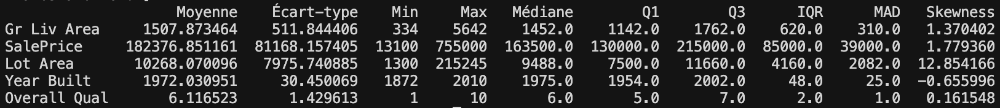
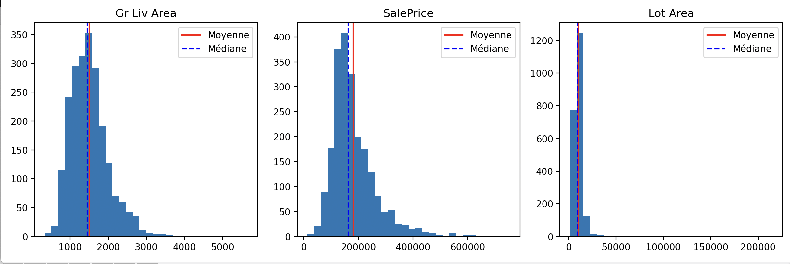
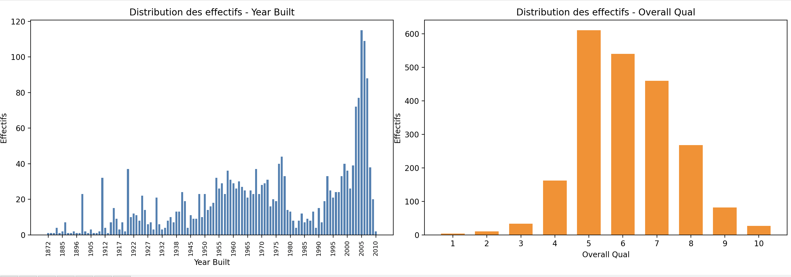

# EDA Visulisation FeatureEngineering

## Sommaire

- [Environnement virtuel (venv)](#environnement-virtuel-venv)
- [Lancer le projet](#lancer-le-projet)
- [Ceci est une docstring](#ceci-est-une-docstring)
- [describe(include='all')](#describeincludeall)
- [Colonnes str -> devraient etre category](#colonnes-str--devraient-etre-category)
- [La difference entre NaN et None](#la-difference-entre-nan-et-none)
- [Lecture simple de describe + skew + kurtosis](#lecture-simple-de-describe--skew--kurtosis)
- [df.select_dtypes(include='number')](#dfselect_dtypesincludenumber)
- [Skewness (rappel simple)](#skewness-rappel-simple)
- [bins (histogramme)](#bins-histogramme)
- [pd.DataFrame.from_dict(..., orient='index')](#pddataframefrom_dict-orientindex)
- [Resultats (images)](#resultats-images)
- [Lecture approfondie du skew](#lecture-approfondie-du-skew)
- [Heatmap (corrélations)](#heatmap-corrélations)

## Environnement virtuel (venv)

Depuis le dossier du projet :

```sh
cd /Users/romain/Desktop/EDA_Vis_FEng
python3 -m venv .venv
source .venv/bin/activate
python -m pip install --upgrade pip
python -m pip install -r requirements.txt
```

Sous Windows (PowerShell) : `.\.venv\Scripts\Activate.ps1` puis les mêmes commandes `pip`.

## `"""Ceci est une docstring"""`

🧠 A quoi ca sert ?

➡️ Expliquer :
- ce que fait une fonction
- ses parametres
- ce qu'elle retourne

📌 Exemple

```python
def moyenne(liste):
    """
    Calcule la moyenne d'une liste de nombres.

    Parametres :
    liste (list) : liste de nombres

    Retour :
    float : moyenne des valeurs
    """
    return sum(liste) / len(liste)
```

🔍 Comment y acceder ?

```python
help(moyenne)
```

ou

```python
moyenne.__doc__
```

## Lancer le projet

Une fois le venv créé et les dépendances installées (voir [Environnement virtuel (venv)](#environnement-virtuel-venv)) :

```sh
cd /Users/romain/Desktop/EDA_Vis_FEng
source .venv/bin/activate
python main.py
```

## `describe(include='all')`

Avec `include='all'`, tu obtiens :

📊 **Colonnes numériques :**
- `mean` (moyenne)
- `std` (écart-type)
- `min` / `max`
- quartiles (`25%`, `50%`, `75%`)

🏷️ **Colonnes catégorielles (texte) :**
- `count` (nombre de valeurs)
- `unique` (nombre de valeurs différentes)
- `top` (valeur la plus fréquente)
- `freq` (fréquence de la plus fréquente)

## Colonnes `str` → devraient être `category`

Toutes ces colonnes sont du texte répétitif (catégories), donc mieux en `category` :

**Exemples :**
- MS Zoning
- Street
- Neighborhood
- House Style
- Kitchen Qual
- Sale Condition
- etc.

👉 **Pourquoi c’est mieux ?**
- moins de mémoire
- plus rapide pour ML
- logique métier (ce ne sont pas des phrases)

## La différence entre `NaN` et `None`

Il est essentiel de comprendre la distinction entre `NaN` et `None` en Python. `NaN` est une représentation en virgule flottante de "Not a Number" (pas un nombre), principalement utilisée dans les calculs numériques. `None`, quant à lui, est un objet Python représentant l'absence de valeur, similaire au `null` dans d'autres langages. Alors que `NaN` est utilisé dans les calculs mathématiques ou scientifiques, `None` est plus polyvalent et indique l'absence de données.

## Lecture simple de `describe()` + `skew` + `kurtosis`

Parfait, tu as affiche un `describe()` + `skew` + `kurtosis`. Voici une lecture simple et directe.

### 1) Ce qui est affiche (ordre)

Tes blocs correspondent a :
- `mean` (moyenne)
- `std` (ecart-type)
- `min`
- `max`
- `median` (50%)
- `Q1` (25%)
- `Q3` (75%)
- `skew`
- `kurtosis`

### 2) Interpretation simple, variable par variable

**Gr Liv Area (surface)**
- Moyenne ~ 1507
- Mediane ~ 1452 (proches)
- `skew = 1.37` (asymetrie positive)
- Conclusion: quelques grandes maisons tirent la moyenne vers le haut.

**SalePrice (prix)**
- Moyenne ~ 182k
- Mediane ~ 163k (moyenne > mediane)
- `skew = 1.77` (forte asymetrie positive)
- `kurtosis ~ 5.48` (beaucoup d'outliers)
- Conclusion: distribution tiree vers le haut, avec quelques maisons tres cheres.
- Typique: transformation log recommandee.

**Lot Area (terrain)**
- Moyenne ~ 10k
- Mediane ~ 9488
- `skew = 12.85` (tres eleve)
- `kurtosis ~ 270` (extreme)
- Conclusion: variable ultra desequilibree, avec des terrains geants qui dominent la distribution.

Transformation utile :
```python
df["Lot Area"] = np.log1p(df["Lot Area"])
```

**Year Built**
- Moyenne ~ 1972
- Mediane ~ 1975 (proches)
- `skew = -0.65` (legerement negatif)
- Conclusion: distribution globalement correcte.

**Overall Qual**
- Moyenne ~ 6.1
- Mediane = 6
- `skew ~ 0.16` (quasi symetrique)
- `kurtosis ~ 0.096` (proche normal)
- Conclusion: variable propre, pas de transformation necessaire.

### 3) Resume rapide

| Variable | Skew | Kurtosis | Interpretation |
|---|---:|---:|---|
| Gr Liv Area | 1.37 | 4.89 | un peu asymetrique |
| SalePrice | 1.77 | 5.48 | asymetrie + outliers |
| Lot Area | 12.85 | 270 | extremement desequilibree |
| Year Built | -0.65 | -0.40 | OK |
| Overall Qual | 0.16 | 0.09 | tres stable |

### 4) A retenir (ML)

- A corriger en priorite: `SalePrice`, `Lot Area`
- A laisser tel quel: `Year Built`, `Overall Qual`

Regle simple:
- `|skew| > 1` -> asymetrie importante
- `kurtosis > 3` -> presence forte d'outliers

## `df.select_dtypes(include='number')`

🧠 Ca veut dire :

➡️ On garde uniquement les colonnes numeriques

📌 Exemple

Si ton DataFrame contient :

| colonne | type |
|---|---|
| SalePrice | int |
| Lot Area | float |
| Neighborhood | object |

👉 Resultat :

`df.select_dtypes(include='number')`

➡️ Garde :
- SalePrice
- Lot Area

❌ Ignore :
- Neighborhood (texte)

## Skewness (rappel simple)

👉 La skewness mesure l'asymetrie

`df.skew()`

🧠 Interpretation
- ~ 0 -> symetrique
- > 0 -> valeurs extremes vers la droite
- < 0 -> valeurs extremes vers la gauche

📌 Exemple

`df["SalePrice"].skew()`

➡️ 1.7 -> il y a des maisons tres cheres qui tirent vers le haut

⚡ Resume

| Element | Role |
|---|---|
| `include='number'` | selectionne les colonnes numeriques |
| `skew()` | mesure l'asymetrie |

🚀 En une ligne

`df.select_dtypes(include='number').skew()`

👉 Tu obtiens la skewness de toutes tes variables numeriques

## `bins` (histogramme)

`bins` = nombre de barres (ou intervalles) dans l'histogramme.

🧠 Concretement

Un histogramme decoupe tes donnees en groupes (intervalles) :

- `bins=10` → 10 barres
- `bins=30` → 30 barres
- `bins=100` → tres detaille

## `plt.tight_layout()`

Quand on cree plusieurs sous-graphiques, par exemple:

```python
fig, axes = plt.subplots(2, 2)
```

on observe souvent:
- les titres qui se chevauchent
- les labels coupes
- des graphiques trop serres

Solution:

```python
plt.tight_layout()
```

`tight_layout()`:
- ajuste automatiquement les marges
- evite les chevauchements
- rend la figure plus propre et lisible

## `fig.tight_layout()`

`fig.tight_layout()` ajuste automatiquement les espaces dans la figure pour eviter que:
- les titres se chevauchent
- les labels soient coupes
- les graphiques se superposent

## `plt.subplots(1, 2, figsize=(12, 4))`

`plt.subplots(1, 2)` signifie:
- 1 ligne
- 2 colonnes

Donc: 2 graphiques cotes a cotes.

### `fig`

`fig` est la figure globale:
- le canvas principal
- il contient tous les graphiques

### `axes`

`axes` correspond aux zones de dessin (les sous-graphiques).

Dans ce cas:
- `axes[0]` = premier graphique (a gauche)
- `axes[1]` = deuxieme graphique (a droite)

### `figsize=(12, 4)`

`figsize` definit la taille de la figure:
- largeur = 12
- hauteur = 4

## `sns.boxplot(...)` (explication rapide)

```python
sns.boxplot(x=df_subset[col], ax=axes[1], color=palette[1])
axes[1].set_title(f"Boxplot - {col}")
```

### 1) `sns.boxplot(...)`

- fonction de Seaborn
- elle cree un boxplot (boite a moustaches)

### 2) `x=df_subset[col]`

- donnees utilisees: une colonne de ton DataFrame
- exemple: `SalePrice`
- tu analyses une seule variable

### 3) `ax=axes[1]` (important)

- `axes[1]` = deuxieme sous-graphique
- donc le boxplot est dessine a droite (dans une mise en page `1x2`)

### 4) `color=palette[1]`

- couleur du graphique
- `palette` est une liste de couleurs
- `[1]` = deuxieme couleur

### Ligne suivante: titre

`axes[1].set_title(f"Boxplot - {col}")` ajoute le titre du deuxieme graphique.

Exemple:
- `Boxplot - SalePrice`

## `pd.DataFrame.from_dict(..., orient='index')`

`pd.DataFrame.from_dict(data, orient='index')` permet de construire un DataFrame a partir d'un dictionnaire en utilisant les cles comme index (lignes), ce qui est pratique pour un tableau recapitulatif de statistiques.

## Resultats (images)

Figure resultat (section 3.4) :



Figure resultat (section 4.1) :



Figure resultat (section 4.2) :



Overall Qual est la note de qualité globale du logement dans Ames Housing.

Lecture rapide :

- Overall Qual = 3 -> qualite plutot faible
- Overall Qual = 6 -> moyenne/correcte
- Overall Qual = 9 -> qualite tres elevee

On peut la traiter comme numerique ordonnee (souvent OK) ou comme categorie ordonnee selon le modele utilise.

## Lecture approfondie du skew

Le skew (asymetrie) mesure uniquement la forme de la distribution.

👉 Donc :
- skew eleve = distribution tres desequilibree
- ca ne dit rien directement sur l'impact sur le prix

Regarde tes resultats :

- Gr Liv Area -> skew = 1.370
- SalePrice -> skew = 1.779
- Lot Area -> skew = 12.854 (!!)

👉 Interpretation :

🔹 Gr Liv Area
- asymetrie moderee a droite
- quelques grandes maisons

🔹 SalePrice
- asymetrie a droite
- quelques maisons tres cheres

🔹 Lot Area
- skew enorme (12.8)
- ca veut dire :
  - enormement de petits terrains
  - + quelques terrains gigantesques (outliers)

3. Le vrai probleme du skew eleve

Un skew eleve indique :

👉 presence d'outliers (valeurs extremes)

Dans ton cas :

Lot Area -> quelques terrains enormes
qui tirent la moyenne vers le haut

📌 On le voit :

- mean = 10268
- median = 9488

👉 la moyenne > mediane -> classique skew a droite

⚠️ 4. Pourquoi c'est dangereux en ML

Un skew eleve peut :

- biaiser la moyenne
- perturber les modeles (regression, etc.)
- donner trop d'importance a quelques valeurs extremes

 5. Impact sur le prix : comment savoir vraiment ?

👉 Pour savoir si une variable impacte le prix, il faut :

✔ correlation

```python
df["Lot Area"].corr(df["SalePrice"])
```

✔ modele (regression)
✔ scatter plot

👉 PAS le skew

 6. Interpretation 

La variable Lot Area presente une tres forte asymetrie (skew=12.8), ce qui indique la presence d'outliers importants. Cela peut biaiser l'analyse et necessiter une transformation (log) avant modelisation. Cependant, le skew ne permet pas de conclure sur son impact direct sur le prix, qui doit etre evalue via la correlation ou un modele.

 

 7. Ce que tu devrais faire ensuite

👉 Tres important pour ton projet :

✔ transformation log

```python
df["Lot Area"] = np.log1p(df["Lot Area"])
```

✔ ou supprimer outliers

 Resume simple

| Concept | Signification |
|---|---|
| Skew eleve | distribution desequilibree |
| Skew eleve | presence d'outliers |
| Skew eleve | pas egal impact sur prix |
| Impact sur prix | correlation / modele |

## Heatmap (corrélations)

Avec `annot=True` (recommandé) :

```python
sns.heatmap(corr, annot=True)
```

👉 Tu vois :
- les couleurs
- les valeurs exactes

🎯 Options utiles avec `annot`

✔ format des nombres

```python
sns.heatmap(corr, annot=True, fmt=".2f")
```

👉 2 chiffres apres la virgule (plus propre)

✔ taille du texte

```python
sns.heatmap(corr, annot=True, annot_kws={"size": 8})
```

✔ meilleure lisibilite

```python
sns.heatmap(corr, annot=True, cmap="coolwarm", fmt=".2f")
```

### Lecture rapide des paramètres

`corr = df.corr()`
- calcule la correlation entre variables numeriques
- renvoie des valeurs entre `-1` et `1`

`annot=True`
- affiche les valeurs dans chaque case
- indispensable pour lire les chiffres exacts

`fmt=".2f"`
- format des nombres
- `.2f` = 2 chiffres apres la virgule

`cmap="coolwarm"`
- palette de couleurs
- bleu = correlation negative
- rouge = correlation positive
- blanc = proche de `0`

`center=0`
- force le centre de la palette a `0`
- negatif -> bleu, positif -> rouge, `0` -> blanc
- evite des couleurs trompeuses

## `jitter=True` dans `sns.stripplot()`

`jitter=True` ajoute une petite dispersion aleatoire sur l'axe categoriel pour eviter que les points se superposent.

Sans jitter:
- plusieurs observations ayant la meme categorie (ex: `Overall Qual = 6`) tombent exactement au meme endroit
- on sous-estime visuellement la densite des points

Avec jitter:
- les points sont legerement decales horizontalement
- la distribution par categorie est plus lisible

Exemple:

```python
sns.stripplot(
    data=df,
    x="Overall Qual",
    y="SalePrice",
    alpha=0.3,
    jitter=True,
    size=2
)
```

Conseil pratique: combine `boxplot` + `stripplot(jitter=True)` pour voir a la fois le resume statistique (boite) et les observations individuelles.

## Corrélation partielle

```python
result = pg.partial_corr(data=dt, x="X", y="Y", covar="Z")
```

👉 avec :
- `dt` = ton DataFrame
- `"X"` = variable 1
- `"Y"` = variable 2
- `"Z"` = variable a controler

### C'est quoi une correlation partielle ?

👉 C'est une correlation en supprimant l'effet d'une autre variable.

🔥 Intuition

👉 Tu veux savoir :

"Est-ce que X influence Y independamment de Z ?"

### Exemple simple (immobilier)

- `X` = surface (`Gr Liv Area`)
- `Y` = prix (`SalePrice`)
- `Z` = localisation

👉 probleme :

- surface et prix sont lies
- MAIS localisation influence aussi le prix

❌ correlation normale

```python
corr(X, Y)
```

👉 melange tout.

✅ correlation partielle

```python
corr(X, Y | Z)
```

👉 enleve l'effet de `Z`.

### Ce que fait `pg.partial_corr`

👉 La librairie Pingouin :

```python
pg.partial_corr(data=dt, x="X", y="Y", covar="Z")
```

👉 retourne :

| colonne | signification |
|---|---|
| `r` | correlation partielle |
| `p-val` | significativite |
| `CI95%` | intervalle de confiance |

### Comment ca marche (idee)

👉 mathematiquement :

- on enleve `Z` de `X` -> residu `X'`
- on enleve `Z` de `Y` -> residu `Y'`
- on correle `X'` et `Y'`

💥 C'est la correlation "pure".

### Pourquoi c'est puissant

👉 Ca evite :

- faux liens
- biais (Simpson)
- variables cachees

### Exemple concret

```python
result = pg.partial_corr(
    data=df,
    x="Gr Liv Area",
    y="SalePrice",
    covar="Overall Qual"
)

print(result)
```

👉 question :

"Est-ce que la surface influence encore le prix si on fixe la qualite ?"

### Resume

| element | role |
|---|---|
| `x` | variable 1 |
| `y` | variable 2 |
| `covar` | variable a controler |
| resultat | correlation sans biais |

💥 Reponse entretien parfaite

👉 "La correlation partielle mesure la relation entre deux variables en controlant l'effet d'une ou plusieurs variables supplementaires. Elle permet d'isoler une relation directe en eliminant les variables confondantes."

## KDE supervisée

Une courbe **KDE supervisee**, c'est simplement une KDE (Kernel Density Estimation) ou tu separes les donnees par classe (label) pour comparer leurs distributions.

### 1) Rappel: KDE (non supervisee)

Une KDE est une version lissee d'un histogramme:
- au lieu de barres, on obtient une courbe
- elle montre la distribution des donnees

### 2) KDE supervisee = par classe

Ici, \"supervisee\" veut dire que tu utilises la target (`y`) pour tracer une courbe par groupe.

Exemples:
- prix des maisons selon `SaleCondition`
- revenu selon une classe
- variable selon fraude / non fraude

Exemple code:

```python
plt.figure(figsize=(8, 5))
sns.kdeplot(data=df, x="SalePrice", hue="Sale Condition", fill=True, common_norm=False, alpha=0.3)
plt.title("KDE supervisee de SalePrice par Sale Condition")
plt.tight_layout()
plt.show()
```

## Ticks sur l'axe des x (Year Built)

`axes[0].set_xticks(x_year[::tick_step])`

`tick_step` :
Les annees ne se chevauchent plus, car on affiche "une annee sur n" sur l'axe x de `Year Built`.

## Explication : `qual_counts`

```python
qual_counts = df_subset["Overall Qual"].value_counts().sort_index()
```

Cette ligne :
- selectionne la colonne `Overall Qual`
- compte le nombre d'occurrences de chaque note (`value_counts`)
- trie les resultats par valeur de note (`sort_index`)

Tu obtiens une serie `note -> effectif`, pratique pour tracer un diagramme en barres ordonne.

