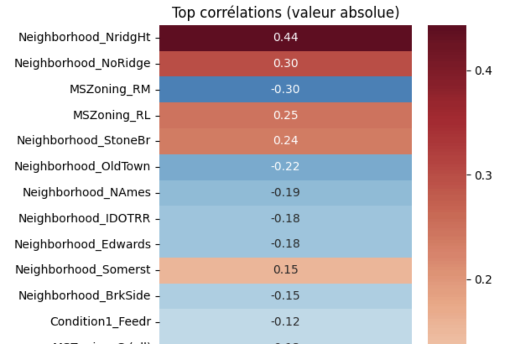
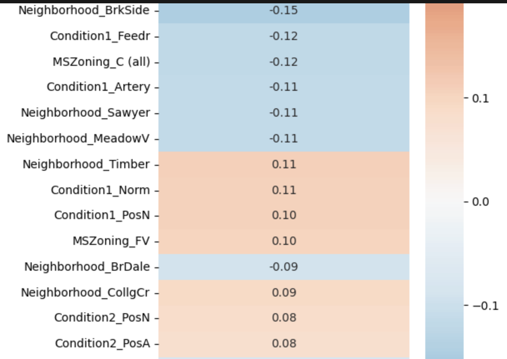
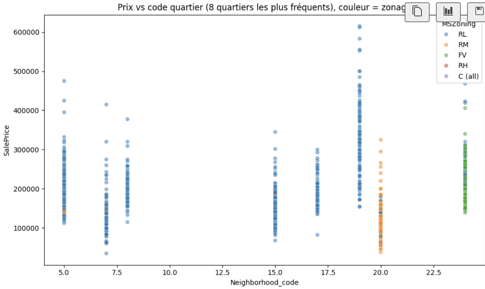
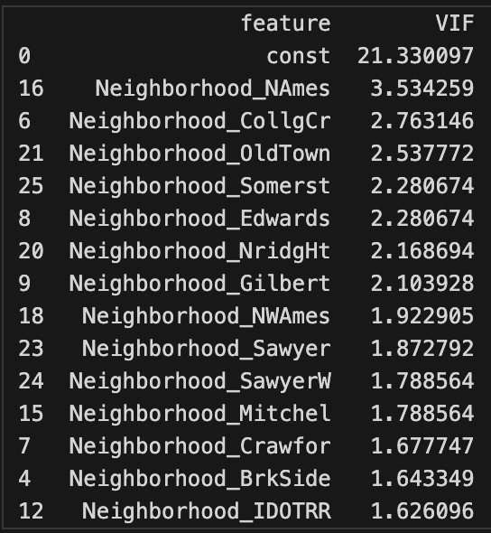

## Sommaire

- [E1bis — Section 5 : outliers sur le prix (IQR, z-score modifié)](#e1bis-section-5)
- [E3bis — Section 1 : one-hot encoding](#e3bis-section-1)
- [E3bis — Section 3 : nuage de dispersion, `MSZoning`](#e3bis-section-3)
- [E3bis — Section 4 : VIF (multicolinéarité)](#e3bis-section-4)
- [E3bis — Section 5 : corrélation partielle (Spearman)](#e3bis-section-5)

---

<a id="e1bis-section-5"></a>

# E1bis — Section 5 : résultats (détection d’outliers sur `SalePrice`)

## Résultats obtenus

```
IQR : bornes [2500, 342500], outliers : 97
z modifié (>|3,5|) : 22 observations
```

---

## 1. Ce que fait l’analyse

On étudie **`SalePrice`** avec **deux méthodes** de détection de valeurs atypiques :

### Méthode 1 — IQR (règle des moustaches)

\[
\text{low} = Q_1 - 1{,}5 \times \text{IQR}, \quad \text{high} = Q_3 + 1{,}5 \times \text{IQR}
\]

- On définit une **zone « normale »** entre `low` et `high`.
- Tout prix **strictement en dehors** de cet intervalle est étiqueté comme **outlier** (`mask_iqr`).

### Méthode 2 — z-score modifié

\[
|z_{\text{mod}}| > 3{,}5
\]

- Méthode **robuste** : centrée sur la **médiane** et l’écart absolu médian (**MAD**), pas sur la moyenne / l’écart-type classiques.
- Ne retient que les valeurs **très** éloignées du centre de la distribution.

---

## 2. Interprétation du print IQR

**`IQR : bornes [low, high], outliers : X`**

| Borne | Lecture |
|--------|---------|
| `low` | Seuil en dessous duquel un prix est considéré **anormalement bas** (par rapport au marché global défini par les quartiles). |
| `high` | Seuil au-dessus duquel un prix est considéré **anormalement élevé**. |

**Dans ton cas : `[2500, 342500]`**

- La borne basse (~2 500 $) est une **conséquence arithmétique** de \(Q_1 - 1{,}5 \times \text{IQR}\) avec des quartiles élevés ; les prix du jeu commencent vers **13 k$**, donc en pratique les outliers IQR par le **bas** sont rares ou inexistants.
- La borne haute (~342 k$) isole surtout les ventes **très chères** au-dessus du « mur » des moustaches.

**`outliers : 97`**

- C’est **`mask_iqr.sum()`** : **97 maisons** ont un prix classé « anormal » au sens **global** IQR (souvent surtout des **grands prix** dans une distribution asymétrique à droite).

---

## 3. Interprétation du z-score modifié

**`z modifié (>|3,5|) : 22 observations`**

- On isole les prix **extrêmement** éloignés de la médiane, en unités robustes (MAD).
- **22 observations** seulement : critère en général **plus strict** que la seule règle IQR sur ce type de distribution.

### Différence clé avec l’IQR

| Méthode | Comportement typique |
|--------|------------------------|
| **IQR** | Peut **marquer davantage** de points (tout ce qui dépasse les moustaches). |
| **z modifié** | Ne garde souvent que les **extrêmes** au sens robuste. |

**Dans ton cas :** 97 (IQR) vs 22 (z modifié) → beaucoup de « modérés » pour l’IQR, peu d’« ultra-extrêmes » pour le z modifié ; les deux listes **ne coïncident pas** exactement.

---

## 4. D’où vient le seuil **3,5** ?

Le seuil **\(|z_{\text{mod}}| > 3{,}5\)** n’est pas arbitraire : il repose sur une **règle empirique** largement citée en statistique robuste, notamment dans :

- **B. Iglewicz & D. Hoaglin (1993)**, *How to Detect and Handle Outliers* (ASQC Quality Press).

Recommandation usuelle : traiter comme valeur aberrante candidate une observation dont le **z-score modifié** dépasse **3,5** en valeur absolue (équivalent robuste à « environ 3,5 écarts-types » par rapport à la médiane).

---

## 5. Ce que ça implique pour **ton** analyse (localisation)

**Objectif :** comprendre le prix **selon le quartier** (`Neighborhood`, etc.).

**Risque sans précaution :** les **très grands** (ou très petits) prix peuvent :

- **fausser la moyenne** par quartier ;
- donner l’impression qu’un quartier est « cher » alors qu’**une seule** vente exceptionnelle tire la moyenne.

**Exemple :** quartier avec des prix 150 k, 160 k, 170 k, **800 k** → la **moyenne** est fortement biaisée ; la **médiane** reste plus représentative du « typique ».

---

## 6. Synthèse combinée (cas possibles)

- **Beaucoup d’outliers IQR, peu pour le z modifié** → marché **hétérogène**, nombreuses maisons au-delà des moustaches mais peu d’extrêmes « ultime ».
- **Quelques outliers au z modifié** → biens **très atypiques** (luxe, très grande surface, cas rares).
- **Peu d’outliers des deux côtés** → marché plus **homogène** (rare ici sur tout le dataset pour le seul critère IQR).

---

## 7. Conclusion métier (Ames Housing)

Les valeurs détectées correspondent souvent à des **biens atypiques** (segment haut de gamme, ou cas particuliers) plutôt qu’à des « erreurs de saisie » évidentes. Pour analyser la **localisation** :

- privilégier la **médiane** (ou quantiles) par quartier plutôt que la moyenne seule ;
- envisager un **filtrage** ou une **analyse sensible** (avec / sans outliers) selon la question métier.

**Formulation possible pour un rendu :**

> L’analyse par IQR et par z-score modifié met en évidence des prix extrêmes dans `SalePrice`. Ces points peuvent biaiser les moyennes par quartier ; des statistiques robustes (médiane) ou un traitement explicite des valeurs atypiques rendent l’analyse de la localisation plus fiable.

---

## 8. Étape suivante (pertinente pour la localisation)

Prix par quartier **robuste** :

```python
df.groupby("Neighborhood")["SalePrice"].median().sort_values()
```

On visualise mieux les **quartiers chers** vs **abordables** qu’avec des moyennes potentiellement tirées par quelques ventes extrêmes.

**Pistes complémentaires :** boxplots par quartier ; stratégie de winsorisation ou d’exclusion documentée des outliers (sans masquer l’information).

---

## 9. Résumé

| Outil | Rôle |
|--------|------|
| **IQR** | Repère les valeurs **hors moustaches** (zone « normale » globale). |
| **z modifié (\|z\| > 3,5)** | Repère les **extrêmes** au sens robuste (réf. Iglewicz & Hoaglin). |
| **Contexte localisation** | Ces points peuvent **fausser** les comparaisons de prix par zone si on ne regarde que la moyenne ; la médiane et les graphiques par quartier sont des compléments naturels. |

---

<a id="e3bis-section-1"></a>

# E3bis — Section 1 : One-Hot Encoding (`ohe.fit_transform(X_cat)`)

## Résultat typique

```
(2197, 53)
```

- **2197** lignes (mêmes observations que `df_loc` sans NaN).
- **53** colonnes = **52** indicatrices (dummy) + **`SalePrice`**.

## Ce que fait le one-hot

- Chaque variable catégorielle (`Neighborhood`, `MSZoning`, `Condition1`, `Condition2`) est **décomposée** : **une colonne par modalité** observée dans les données d’entraînement.
- Pour chaque ligne, **une seule** colonne par variable « originale » vaut **1** (présence de la modalité), les autres valent **0** (absence).

Exemple pour la première ligne :

```text
Neighborhood_SawyerW    1.0
MSZoning_RL             1.0
Condition1_Norm         1.0
Condition2_Norm         1.0
```

… ce sont les **seules** indicatrices à 1 pour cette maison (les autres colonnes dummy sont à 0).

## Affichage des 8 premières colonnes : `df_num.iloc[:, :8]`

On regarde souvent **`df_num.iloc[:, :8].head()`** pour un aperçu compact.

Les noms des 8 premières colonnes suivent l’ordre produit par scikit-learn (`get_feature_names_out(...)`), en général **d’abord** les indicatrices **`Neighborhood_*`** triées par ordre de **nom de modalité** (ex. `Neighborhood_Blmngtn`, `Neighborhood_BrDale`, …).

### Point d’attention (pas un bug)

Pour la **ligne 0**, la maison est à **SawyerW** (`Neighborhood_SawyerW` = 1).

- Les **8 premières** colonnes du tableau sont les **8 premiers quartiers dans l’ordre alphabétique des noms** (`Blmngtn`, `Blueste`, `BrDale`, …), **pas** `SawyerW`.
- Donc **sur ces 8 colonnes-là**, toutes les colonnes du type `Neighborhood_*` affichées sont à **0** : c’est normal, le **1** pour SawyerW se trouve dans une **autre** colonne (plus loin dans le DataFrame).

**En résumé :** le « quartier actif » de la ligne n’apparaît pas dans le coin `[:, :8]` — il faut soit parcourir les colonnes jusqu’à `Neighborhood_SawyerW`, soit filtrer avec `df_num.loc[0, df_num.columns.str.startswith("Neighborhood_")]` (ou afficher toutes les colonnes où la valeur vaut 1).

## Piège : `df_num.iloc[:, :0]`

Si tu écris **`iloc[:, :0]`**, tu sélectionnes **zéro colonne** → **DataFrame vide** :

```text
Empty DataFrame
Columns: []
Index: [0, 1, 2, 3, 4]
```

Ce n’est **pas** un résultat du one-hot : c’est une **tranche vide**. Utiliser **`iloc[:, :8]`** (ou un autre nombre de colonnes) pour un aperçu utile.

## Vérifier la ligne 0 sans tout afficher

Pour lister **uniquement** les indicatrices à **1** (hors `SalePrice`) :

```python
s = df_num.iloc[0].drop("SalePrice", errors="ignore")
print(s[s == 1])
```

Tu retrouves bien les modalités actives (ex. `Neighborhood_SawyerW`, `MSZoning_RL`, …).

## 6. Pourquoi c’est utile ?

Un modèle numérique (régression, Lasso, etc.) ne prend pas en entrée des chaînes de caractères comme `"NAmes"` ou `"RL"` : il attend des **nombres**.

Le **one-hot** transforme chaque modalité en **colonnes 0/1** : le modèle peut alors apprendre des **poids** associés à chaque quartier, chaque zonage, etc.

## 7. Dans ton objectif (localisation → prix)

Une fois `df_num` construit (indicatrices + `SalePrice`), tu peux par exemple :

- calculer la **corrélation** (Pearson) de chaque colonne avec le prix :

```python
df_num.corr()["SalePrice"].sort_values()
```

- lire quels **quartiers** (ou zonages) sont les plus associés à un prix **élevé** ou **bas** dans cette métrique linéaire simple.

Exemples d’interprétation (les noms et valeurs dépendent du jeu) :

- `Neighborhood_NoRidge` → corrélation souvent **forte** (quartier associé à des prix élevés dans la matrice de corrélation).
- `Neighborhood_MeadowV` → corrélation **plus faible** ou négative selon le cas (à vérifier sur les sorties réelles).

### Figures : heatmaps (corrélation avec `SalePrice`)

Les captures ci-dessous (issues du notebook E3bis, heatmap des corrélations les plus fortes avec le prix) montrent visuellement que **certains quartiers sont beaucoup plus liés au niveau de prix que d’autres** : les couleurs plus intenses (positif ou négatif) correspondent à une influence plus marquée dans cette vue linéaire simple.





**Lecture :** comparer les lignes ou blocs `Neighborhood_*` entre eux : un quartier dont l’indicatrice a une corrélation plus forte (en valeur absolue) avec `SalePrice` « tire » davantage le prix dans ce modèle descriptif qu’un quartier proche de 0.

## 8. Piège important : beaucoup de colonnes et multicolinéarité

Avec **OneHotEncoder** sans option particulière :

- tu crées **beaucoup** d’indicatrices (surtout pour `Neighborhood`) ;
- pour une même variable catégorielle, les colonnes sont **dépendantes** (exactement une modalité vaut 1 par ligne) ⇒ **multicolinéarité** possible si tu ajoutes un intercept ou d’autres variables redondantes.

**Piste fréquente :** `OneHotEncoder(drop="first")` pour retirer une modalité de référence par variable et limiter la **dummy trap** (multicolinearité parfaite avec la constante).

## 9. Résumé simple (pourquoi tu vois des 0)

Tu peux voir **uniquement des 0** sur les colonnes affichées parce que :

- tu n’affiches qu’un **sous-ensemble** de colonnes (ex. les 8 premières) ;
- la **catégorie active** de cette ligne (ex. le quartier réel) correspond à une **autre** colonne, plus loin dans le tableau.

**En réalité :** chaque ligne a bien des **1** (une par bloc d’origine : `Neighborhood`, `MSZoning`, etc.), simplement **pas** sur les colonnes que tu regardes au moment du `print`.

## 10. Formulation utile (entretien / oral)

> « Le one-hot encoding crée **une colonne par modalité**. Si on n’affiche qu’une partie des colonnes, il est **normal** de ne voir que des 0 pour les quartiers qui ne correspondent pas à la ligne : le **1** se trouve dans la colonne de la **modalité réelle**, ailleurs dans le DataFrame. »

---

# E3bis — Section 3 : nuage de dispersion (quartiers les plus représentés)

Dans le notebook, on restreint souvent l’analyse à un sous-ensemble de quartiers pour garder des graphiques **lisibles** (trop de modalités = nuage illisible ou surchargé).

## Code

```python
sample_nbh = df_loc["Neighborhood"].value_counts().head(8).index
sub = df_loc[df_loc["Neighborhood"].isin(sample_nbh)]
```

## Interprétation

- **`value_counts()`** compte combien de ventes il y a par quartier (effectifs décroissants).
- **`.head(8)`** garde les **8 premières lignes** de ce classement, donc les **8 quartiers les plus fréquents** dans les données (les plus « présents »).
- **`.index`** récupère seulement les **noms** de ces quartiers (pas les effectifs).
- **`sub`** est le DataFrame filtré : **uniquement les lignes** dont le quartier appartient à ce groupe de 8.

**Pourquoi faire çà ?** On travaille sur les quartiers qui concentrent le plus d’observations : les graphiques restent interprétables, tout en illustrant la variabilité du prix selon la localisation. Les quartiers **rares** (très peu de maisons) peuvent être analysés à part ou agrégés.

### `MSZoning` dans le scatter plot (`hue="MSZoning"`)

Dans la cellule suivante du notebook, la **couleur des points** encode le **type de zonage** (`MSZoning`), pas le quartier :

- **`hue="MSZoning"`** → chaque modalité de zonage a une couleur distincte.
- C’est la règle d’**usage du sol** (zoning) : le code municipal indique ce qui est autorisé sur le lot (densité, usage dominant, etc.).

#### Signification des codes (référence Ames Housing)

| Code | Libellé (EN) | Lecture métier |
|------|----------------|----------------|
| **RL** | Residential Low Density | Zone **résidentielle faible densité** : surtout maisons individuelles, quartiers souvent « calmes » ; en pratique, segment souvent associé à des **prix élevés** (gros lots, standing). |
| **RM** | Residential Medium Density | Résidentiel **densité moyenne** : maisons et petits immeubles / duplex ; **prix typiquement intermédiaires**. |
| **RH** | Residential High Density | Résidentiel **haute densité** : immeubles, logements plus compacts ; **prix souvent plus bas** au pied carré (à nuancer selon quartier). |
| **FV** | Floating Village Residential | Zone résidentielle de type **village / lotissement** (souvent lotissements récents ou zonage spécifique) ; constructions **récentes**, profil **haut de gamme** possible → **prix souvent élevés**. |
| **C (all)** ou **C** | Commercial | Zone à dominante **commerciale** (magasins, bureaux) ; peu de résidentiel pur ; **prix très variables** selon l’usage réel du bien. |

*(Autres codes possibles dans le fichier : `A (agr)` agricole, `I (all)` industriel, etc., plus rares.)*

**Idée clé :** le **zonage explique une partie du prix** : on peut avoir le **même quartier** (`Neighborhood`) mais des **prix différents** selon que le lot est en **RL**, **RM**, **FV**, etc.

#### Figure (section 3 du notebook)



**Lecture :** sur ce graphique, chaque couleur correspond à un type de zonage ; on compare la dispersion des **prix** (axe vertical) pour les **8 quartiers les plus fréquents** (code en abscisse), en voyant comment **RL**, **RM**, **FV**, etc. se répartissent.

> Certains quartiers semblent **spécialisés** avec une **dominance** d’un type de zonage, notamment **RL**, mais cette spécialisation **n’est pas absolue** : on observe une **certaine diversité** au sein des quartiers.

**Rappel sur le filtre `sample_nbh` :** ce n’est **pas** un tirage aléatoire : on garde toujours les **mêmes** 8 quartiers les plus représentés (tant que `df_loc` ne change pas).

---

<a id="e3bis-section-4"></a>

# E3bis — Section 4 : VIF (multicolinéarité) sur un sous-ensemble d’indicatrices

Après le one-hot, `X_dum` contient **beaucoup** de colonnes (une par modalité). Calculer le **VIF** (Variance Inflation Factor) sur **toute** la matrice d’un coup est souvent **lourd** (temps de calcul, risques de singularité ou de matrices mal conditionnées).

## Code typique

```python
k = min(25, X_dum.shape[1])
X_vif = sm.add_constant(X_dum.iloc[:, :k])
```

## Calcul du VIF

```python
vifs = [
    variance_inflation_factor(X_vif.values, i)
    for i in range(X_vif.shape[1])
]
vif_df = pd.DataFrame({"feature": X_vif.columns, "VIF": vifs})
```

**Principe :** pour **chaque** colonne \(i\) de `X_vif`, `variance_inflation_factor` mesure **dans quelle mesure** cette variable est **redondante** avec les **autres** colonnes (en pratique : on régresse la variable \(i\) sur toutes les autres ; le VIF est une fonction du \(R^2\) de cette régression auxiliaire).

- **En bref :** pour chaque variable, on mesure **à quel point elle est « expliquée » par les autres** du même bloc. Plus le VIF est **élevé**, plus la variable est **alignée** avec une combinaison linéaire des autres → **multicolinéarité** possible.

*(Formule usuelle : \(\mathrm{VIF}_j = \frac{1}{1 - R_j^2}\) où \(R_j^2\) est le \(R^2\) de la régression de la variable \(j\) sur toutes les autres.)*

## Ce que ça fait (préparation de la matrice)

- **`k = min(25, X_dum.shape[1])`**  
  On ne garde au plus que **25 colonnes** d’indicatrices (ou moins si le DataFrame en a moins de 25).  
  **Pourquoi 25 ?** C’est un **plafond pratique** : le VIF se calcule par régression auxiliaire pour chaque colonne ; au-delà, le calcul devient **plus coûteux** et la sortie moins lisible pour un premier diagnostic. Ce n’est pas une règle statistique universelle, un **compromis** « assez grand pour voir des effets » / « pas trop lourd ».

- **`X_dum.iloc[:, :k]`**  
  On prend les **k premières** colonnes de `X_dum` (ordre des colonnes tel que sklearn / pandas les a créées). Ce n’est donc **pas** un choix « optimal » des variables : c’est un **sous-échantillon fixe** pour illustration. Pour une analyse complète, on pourrait choisir un autre sous-ensemble (par ex. uniquement les `Neighborhood_*`, ou les colonnes au VIF le plus suspect après un premier passage).

- **`sm.add_constant(...)`**  
  On ajoute une colonne de **1** (intercept) car les modèles de régression utilisés en interne pour le VIF incluent habituellement une constante.

## Rappel rapide : échelle du VIF

| VIF | Lecture usuelle |
|-----|-----------------|
| **= 1** | Aucune redondance linéaire avec les autres variables du bloc (cas idéal théorique). |
| **Entre 1 et 5** | Corrélation / redondance **modérée**, souvent **acceptable** en pratique. |
| **> 5** | Ça commence à être **gênant** : multicolinéarité notable. |
| **> 10** | **Problème sérieux** : forte dépendance avec les autres prédicteurs. |

*(Les seuils 5 et 10 sont des **repères** courants, pas des lois fixes ; le contexte et le modèle comptent.)*

## Résultat typique (E3bis section 4)

Sortie après `vif_df.sort_values("VIF", ascending=False).head(15)` — capture du notebook :



**Lecture sur cet exemple :**

- La ligne **`const`** (intercept) affiche souvent un **VIF élevé** (ici ≈ 21) : c’est **fréquent** et on l’**interprète différemment** des variables explicatives ; le diagnostic de multicolinéarité entre **prédicteurs** se fait surtout sur les **indicatrices**, pas sur la constante seule.
- Parmi les **`Neighborhood_*`**, le **maximum** est autour de **3,53** (`Neighborhood_NAmes`) : on reste **sous le seuil de 5** → zone **plutôt acceptable**.
- **Conclusion pratique :** les variables testées sur ce sous-ensemble sont **un peu liées** entre elles (c’est attendu avec des dummies de quartiers dans la même matrice), mais **pas de façon problématique** au sens des repères ci-dessus.

## Interprétation rapide (générale)

- Un **VIF élevé** sur les **prédicteurs** (souvent \> 5 ou 10 selon les auteurs) suggère une **forte redondance** — **normal** entre indicatrices d’une même variable catégorielle si on n’a pas utilisé `drop="first"`.
- Les résultats sur **25 colonnes seulement** donnent un **aperçu** : ils ne remplacent pas une stratégie complète (regularisation, `drop="first"`, ou regroupement de modalités).

---

<a id="e3bis-section-5"></a>

# E3bis — Section 5 : corrélation partielle (Spearman)

## Ce qui est calculé

Dans le notebook, après encodage numérique (`LabelEncoder`) de `Condition1` et `MSZoning` :

```python
pg.partial_corr(
    data=df_loc,
    x="SalePrice",
    y="Cond1_num",
    covar="MSZ_num",
    method="spearman",
)
```

**Objectif :** mesurer la **relation** entre **`Condition1`** (proximité / environnement, en codes numériques) et **`SalePrice`**, **en contrôlant** le **zonage** (`MSZoning` → `MSZ_num`). Autrement dit : une fois l’effet linéaire du zonage pris en compte au sens de cette corrélation partielle, reste-t-il un lien entre la condition de proximité et le prix ?

## Pourquoi le calcul change ? Corrélation simple vs corrélation partielle

### Corrélation simple (`pg.corr` ou équivalent)

- Mesure le **lien brut** entre `Condition1` (encodé) et `SalePrice` **sans** retirer l’influence d’autres variables.
- Exemple d’appel :

```python
pg.corr(x=df_loc["SalePrice"], y=df_loc["Cond1_num"], method="spearman")
```

### Corrélation partielle (`pg.partial_corr(..., covar="MSZ_num")`)

- Mesure le lien entre **`Condition1`** et **`SalePrice`** **après avoir pris en compte** (au sens de la méthode utilisée) **`MSZoning`** via `MSZ_num`.
- Ce n’est **pas** la même quantité que la corrélation simple : on ne mesure plus seulement « tout ce qui fait varier le prix avec Condition1 », mais une partie du lien **une fois le zonage contrôlé**.

### Intuition

`Condition1` peut être lié au **prix**, mais **`MSZoning`** influence aussi le **prix**, et **`Condition1`** peut être **non indépendant** du **zonage** (certaines proximités sont plus fréquentes dans certains zonages). Une partie de la **corrélation simple** entre `Condition1` et `SalePrice` peut donc **transiter** par le **zonage** : la corrélation partielle cherche à isoler ce qui reste une fois cet **effet de confondage** (ou de chevauchement) pris en charge par `covar`.

### Idée des étapes (simplifiée)

Sous une forme schématique, la corrélation partielle entre \(Y\) et \(X\) en contrôlant \(Z\) revient à **corriger** \(X\) et \(Y\) par rapport à \(Z\) (selon le modèle linéaire / rang sous-jacent), puis à **corréler les résidus** — ce qui revient à se demander : « **au-delà** de ce que le zonage explique déjà du prix et de Condition1, reste-t-il une association ? »

### Comparaison sur des exemples numériques

Sur un même jeu, on peut typiquement obtenir :

| Type | \(r\) (Spearman) approximatif | Lecture |
|------|-------------------------------|--------|
| **Corrélation simple** | ≈ **0,1837** | Relation **brute** entre `Condition1` et `SalePrice`. |
| **Corrélation partielle** (contrôle `MSZoning`) | ≈ **0,1761** | Relation **sans** la part de **liaison** entre `Condition1` et `SalePrice` qui **passe** aussi par le **zonage** (au sens de cette méthode). |

**Écart :** \(0{,}1837 - 0{,}1761 \approx 0{,}0076\) → **petit**. Donc **`MSZoning` n’est pas un énorme facteur de confusion** dans ce calcul : une petite fraction de la corrélation simple était **explicable** par le lien avec le zonage ; le **gros** reste similaire.

### Cas où l’écart serait grand (confondant majeur)

Si tu avais par exemple :

- corrélation **simple** ≈ **0,4** ;
- corrélation **partielle** (contrôle du même confondant) ≈ **0,1** ;

alors une **grande partie** de la relation apparente entre `Condition1` et `SalePrice` pourrait venir **du confondant** (ici le zonage) plutôt que d’un effet « propre » de `Condition1` — il faudrait alors **interpréter avec prudence** la corrélation simple et privilégier la lecture **conditionnelle**.

## Résultat typique (sortie `pingouin`)

```
         n      r          CI95         p_val
spearman  2197  0.176069  [0.14, 0.22]  9.477779e-17
```

*(Les bornes de l’intervalle de confiance peuvent varier légèrement selon la version de `pingouin` ; l’ordre de grandeur reste le même.)*

## Interprétation des colonnes

### CI95 % — intervalle de confiance à 95 %

**CI95 %** = **intervalle de confiance à 95 %**.

C’est une **plage de valeurs** dans laquelle, **avec 95 % de confiance** (au sens de la procédure statistique utilisée), on situe la **« vraie » valeur** du paramètre estimé — ici, la corrélation partielle **dans la population** — compte tenu de l’**incertitude** liée à l’échantillon.

| Élément | Valeur (exemple) | Lecture |
|--------|-------------------|---------|
| **`n`** | 2197 | Nombre d’observations utilisées : échantillon **large** → résultats **plus stables** qu’avec un petit \(n\). |
| **`r`** | ≈ 0,176 | Corrélation partielle de **Spearman** : **positive mais faible**. Quand l’ordre / le code de `Condition1` augmente (selon l’encodage choisi), le prix tend à **augmenter légèrement** — effet **modeste**, ce n’est **pas** le facteur principal du prix. |
| **`p_val`** | ≈ 9,5×10⁻¹⁷ | Très proche de **0** : la corrélation est **statistiquement significative** (peu plausible qu’elle soit due au hasard **si** les conditions du test sont raisonnablement remplies). |
| **`CI95`** | [0,14 ; 0,22] environ | Intervalle de confiance à **95 %** pour la corrélation « vraie » : entièrement **strictement positif** → cohérent avec une association **positive** faible à modérée dans la population, au sens de ce modèle. |

## Synthèse

Même en **retirant l’effet du zonage** au sens de cette **corrélation partielle** (contrôle de `MSZoning`), il reste une association entre **`Condition1`** et **`SalePrice`**, mais **d’intensité faible** (\(r \approx 0{,}18\)).

## Traduction métier

- **`Condition1`** décrit la **proximité** (route, voie ferrée, parc, etc.) dans les données Ames.
- **Lecture :** certaines configurations de proximité **influencent** le prix, mais **de façon limitée** par rapport à d’autres leviers (surface, qualité, quartier, etc.) — ce qui est cohérent avec un **\(r\)** faible mais **significatif** sur un grand \(n\).

**Formulation possible pour un rendu :**

> La corrélation partielle entre le prix et `Condition1`, **contrôlée par le zonage**, est **faible mais significative** (\(r \approx 0{,}18\)). Cela suggère que l’**environnement immédiat** (proximité) joue un rôle sur le prix, mais de manière **modeste** par rapport à d’autres variables du marché.

**Limites :** `Cond1_num` et `MSZ_num` sont des **codes ordinaux arbitraires** (LabelEncoder) : l’ordre n’est pas toujours métier ; une analyse plus poussée utiliserait des contrastes ou des modèles avec variables catégorielles explicites.
