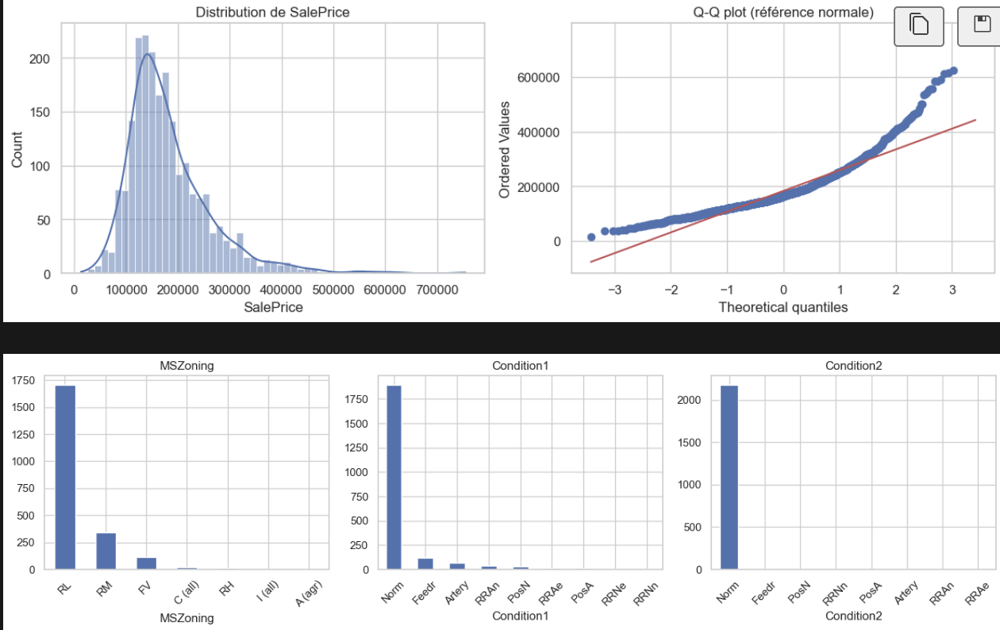
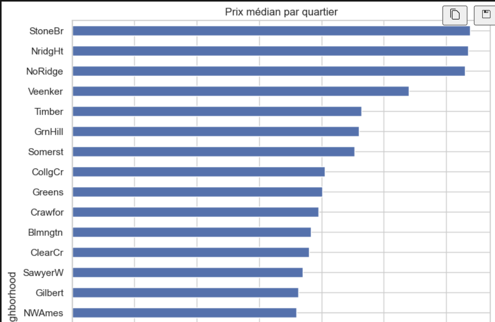
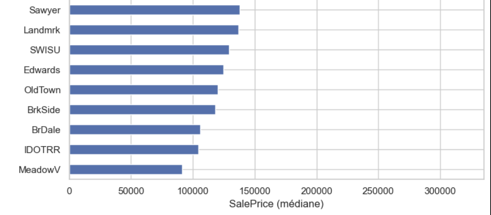
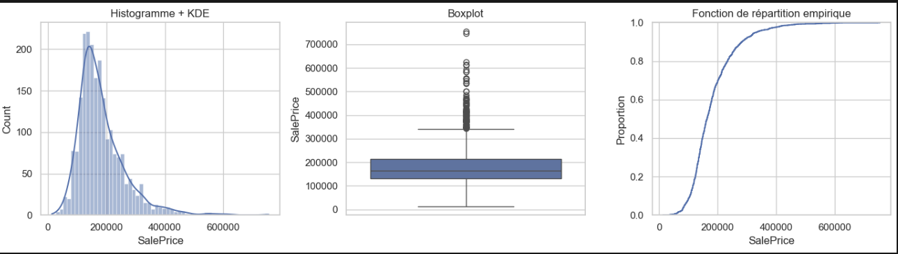
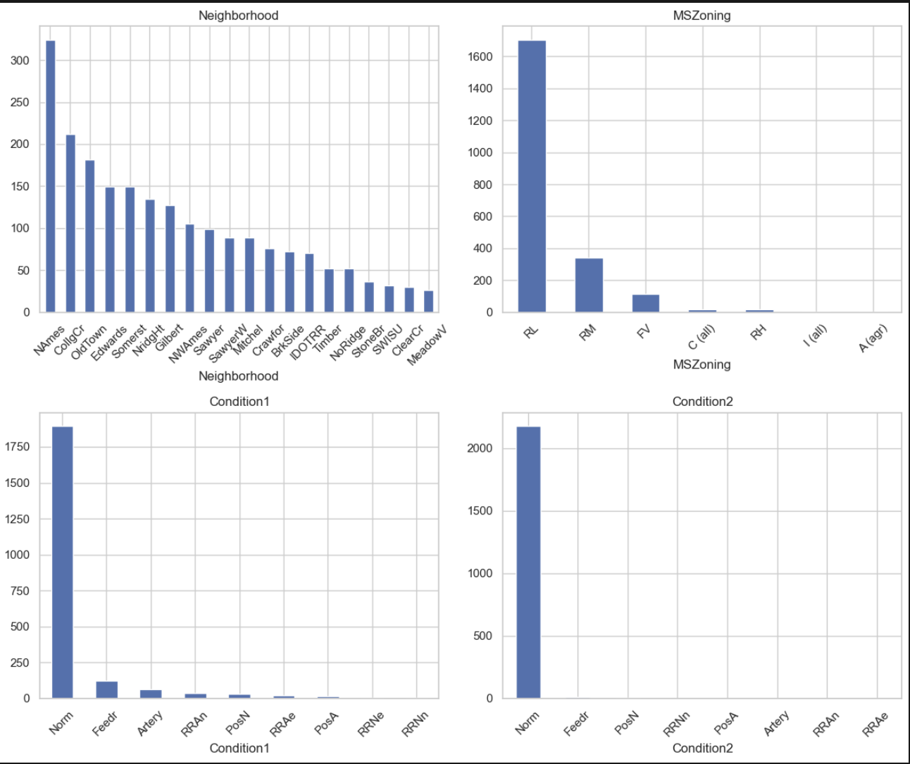
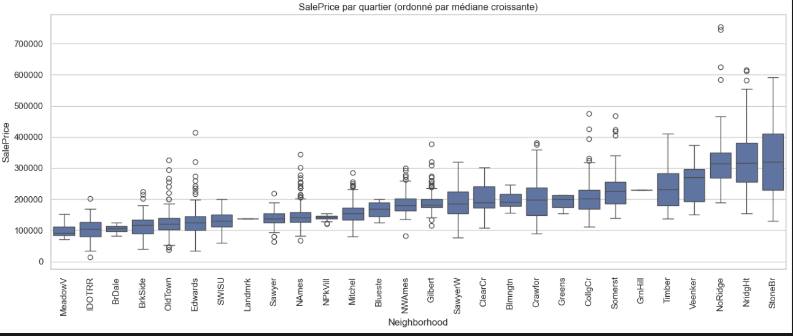

<!--
================================================================================
PROMPT POUR GAMMA (gamma.app) — copier-coller tel quel dans « Create with AI »
================================================================================

Crée une présentation professionnelle en français, environ 10 slides, format 16:9, ton clair et pédagogique (public data science / immobilier).

Sujet : analyse exploratoire et feature engineering sur le jeu **Ames Housing** (prix de vente `SalePrice`), à partir d’une démarche notebooks Python (pandas, seaborn, scikit-learn).

Structure demandée :
1. **Titre** — EDA & feature engineering, dataset Ames Housing ; mention des volets E1bis, E2bis, E3bis, E5bis / E5 ter.
2. **Distribution du prix** — histogramme + KDE : concentration 100k–200k USD, asymétrie à droite ; Q-Q plot : non-normalité ; justification d’une transformation `log1p(SalePrice)`.
3. **Localisation** — fortes différences de prix entre quartiers (`Neighborhood`) ; la localisation est un levier clé, à compléter par des variables structurelles.
4. **Vues univariées** — côte à côte ou une slide : histogramme+KDE, boxplot (médiane, IQR, outliers hauts), ECDF (interpréter : proportion de maisons ≤ un prix ; montée rapide puis plateau).
5. **Variables catégorielles** — barplots d’effectifs : `Neighborhood` déséquilibré ; `MSZoning` dominé par RL ; `Condition1` surtout Norm ; `Condition2` quasi tout Norm (faible utilité).
6. **Boxplots par quartier** — quartiers triés par médiane de prix croissante ; message : plus le quartier est cher, plus la dispersion des prix intra-quartier tend à augmenter.
7. **Corrélations** — heatmaps des corrélations les plus fortes avec `SalePrice` après one-hot (effet quartier visible).
8. **Analyse bivariée** — scatter prix vs quartier avec couleur = `MSZoning` (zonage) ; diversité des prix au sein d’un quartier.
9. **Multicolinéarité** — slide VIF sur un sous-ensemble de dummies après one-hot ; rappeler seuils 5/10 et prudence sur la ligne `const`.
10. **Modélisation & conclusion** — tableau RMSE indicative : localisation seule ~53k USD → ajout variables numériques (OverallQual, surfaces…) ~35k / Ridge+log ~33k → features métier enrichies (TotalSF, LotArea, qualités…) ~32k USD ; messages : `log1p` sur y, `Neighborhood` central, pipelines (OHE, TargetEncoder, Ridge/Lasso).

Style visuel : data / pro, graphiques nets, peu de texte par slide, puces courtes. Si des placeholders d’images sont nécessaires, indiquer légendes du type « Histogramme + KDE », « Boxplots par quartier », « Heatmap corrélations », « VIF ».

================================================================================
-->

<!-- _class: lead -->
# Analyse exploratoire & feature engineering
## Jeu **Ames Housing**
**Notebooks** E1bis · E2bis · E3bis · E5bis / E5 ter — document détaillé : **`resultat.md`**

---

# Distribution du prix (`SalePrice`)
- Histogramme + **KDE** : concentration **~100 k$ – 200 k$**, **queue à droite** (*skew*).
- **Q-Q plot** : écart aux grands quantiles → **non-normalité** ; intérêt de **`log1p(SalePrice)`** pour la suite.

---

# Prix et localisation (quartiers)
- Écarts **marqués** de niveau de prix selon **`Neighborhood`**.
- La **localisation** est un **levier clé** ; compléter par des variables **structurelles** pour affiner.

---

# Trois vues univariées du prix (E2bis)
**Histogramme + KDE** · **Boxplot** · **ECDF**

- Skew à droite, **outliers** hauts sur le boxplot.
- **ECDF** : montée rapide ~100–200 k$ → majorité des ventes ; plateau vers 1 → rareté des très grands prix.

---

# Variables catégorielles (effectifs)
**`Neighborhood`** : modalités **déséquilibrées** (NAmes, CollgCr, OldTown…).  
**`MSZoning`** : **RL** domine largement.  
**`Condition1`** / **`Condition2`** : quasi tout **Norm** → **faible** variabilité ; **`Condition2`** quasi constante.

---

# Prix par quartier (médiane croissante)
- Les quartiers sont ordonnés par **médiane** de `SalePrice` **croissante** (gauche → droite).
- **Plus le quartier est cher, plus la dispersion (IQR / étendue) tend à être forte** — segments hétérogènes dans les zones premium.

---

# Corrélations avec le prix (one-hot)
- Heatmap des **corrélations** (Pearson) les plus fortes avec **`SalePrice`**.
- Certains **`Neighborhood_*`** ressortent nettement : effet **quartier** visible dans une vue **linéaire simple**.

---

# Prix vs quartier, couleur = zonage (`MSZoning`)
- Nuage **prix** vs **code quartier** (sous-ensemble lisible), **`hue=MSZoning`**.
- Illustre la **cohabitation** de plusieurs zonages dans un même quartier et la **dispersion** des prix.

---

# Multicolinéarité après one-hot (VIF)
- VIF sur un **sous-ensemble** de colonnes (ex. **25** premières dummies) — **aperçu**, pas un diagnostic exhaustif.
- **`const`** : VIF souvent élevé (à interpréter à part). Indicatrices **`Neighborhood_*`** : ici **sous le seuil ~5** sur l’exemple — redondance **modérée**, pas « explosion ».

---

# Modèles, RMSE & conclusion
| Étape | Ordre de grandeur RMSE ($) |
|--------|----------------------------|
| **E5bis** — localisation seule (Lasso) | ~**53 k** |
| **E5bis amélioré** — + surfaces / qualité | ~**35 k** → Ridge+log ~**33,6 k** ; FE ~**33,3 k** |
| **E5 ter** — features métier enrichies | ~**31,8 k** (Lasso / Ridge+log typiques) |

**À retenir :** prix **asymétrique** → **`log1p(y)`** · **`Neighborhood`** central · **`Condition2`** peu informative · **FE + pipelines** → RMSE **~53 k$ → ~32 k$**.

**Merci de votre attention** 
